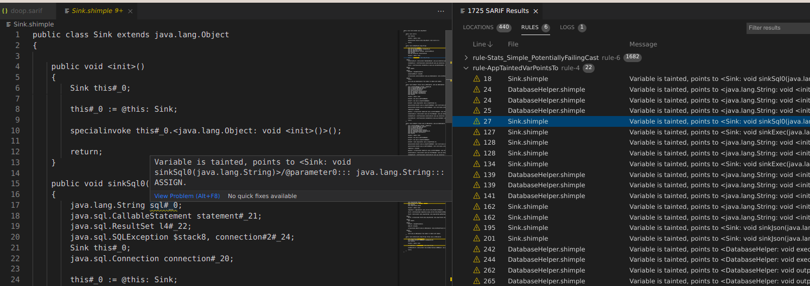

# Doop - Framework for Java Pointer and Taint Analysis (using P/Taint)

This document contains instructions for invoking the main driver of Doop. 
* For an introduction to Datalog, please consult [Datalog-101](docs/datalog-101.md). 
* For a more detailed tutorial on using the results of Doop analyses, please consult [Doop-101](docs/doop-101.md). 
* For an introduction to pointer analysis using Datalog, you can read a [research-level tutorial](http://yanniss.github.io/points-to-tutorial15.pdf).
* For the architecture of Doop, see [docs/documentation.md](docs/documentation.md).

## Getting Started

At its core, Doop is a collection of various analyses expressed in the form of Datalog rules. The framework has two versions of its rules:

1. The currently maintained version targets
   [Soufflé](http://souffle-lang.org/), an open-source Datalog engine
   for program analysis (which is the default engine used). In order
   to install an up-to-date version of Soufflé, the best practice is
   to clone the development Github
   [repo](https://github.com/souffle-lang/souffle) and follow the
   instructions found on [this
   page](https://souffle-lang.github.io/build). Doop is currently
   tested with Souffle versions 1.5.1, 2.0.2, and 2.1.

2. The legacy (unmaintained) version uses **LogiQL**, a Datalog
   dialect developed by [LogicBlox](http://www.logicblox.com/). For a
   LogicBlox engine, you can use **PA-Datalog**, a port available for
   academic use, by following the instructions found on [this
   page](http://snf-705535.vm.okeanos.grnet.gr/agreement.html).

For trouble-free configuration:

* The `DOOP_PLATFORMS_LIB` environment variable could point to your PLATFORM lib directory (optional, see below).
* The `DOOP_OUT` environment variable could point to the output files directory (optional, defaults to `out`).
* The `DOOP_CACHE` environment variable could point to the cached facts directory (optional, defaults to `cache`).
* The `DOOP_LOG` environment variable could point to a log output directory (optional, defaults to `build/logs`).
* The `LOGICBLOX_HOME` environment variable should point to the `logicblox` directory of the engine, if you want to use LogicBlox.

Support:

(a) Email: there is currently no mailing list, but there is an alias for support questions: doop-support@googlegroups.com

(b) [Discord server](https://discord.gg/4q7rj5s)

## Benchmarks & Platform Lib

For a variety of benchmarks, you could clone (or download) the [doop-benchmarks](https://bitbucket.org/yanniss/doop-benchmarks) repository.

One important directory in that repository is `JREs`. It can be used for the `DOOP_PLATFORMS_LIB` environment variable. It contains certain java library files for different JRE versions, necessary for analysis purposes. If you would like to provide a custom DOOP_PLATFORMS_LIB directory (e.g., to run analyses using different minor versions), you should follow the same file structure. For example, in order to analyze with JRE version 1.6, you need a `jre1.6` directory containing at least `jce.jar`, `jsse.jar` and `rt.jar`. In order to run an an analysis on an android apk ideally you could create a link to your android sdk installation. The currently supported structure is Android/Sdk/.

## Running Doop

Doop only supports invocations from its home directory. The main options when running Doop are the analysis and the jar(s) options. For example, for a context-insensitive analysis on a jar file we issue:

    $ ./doop -a context-insensitive -i com.example.some.jar

### Common command line options
To see the list of available options (and valid argument values in certain cases), issue:

    $ ./doop -h

The options will be also shown if you run Doop without any arguments.

The major command line options are the following:

#### Analysis (-a, --analysis)
Mandatory. The name of the analysis to run.

Example:

    $ ./doop -a context-insensitive

#### Input files  (-i, --input-file)
Mandatory. The input file(s) to analyse.

The inputs option accepts multiple values and/or can be repeated multiple times.

The value of the input file can be specified in the following manners:

* provide the relative or absolute path to a local input file.
* provide the URL of a remote input file.
* provide the relative or absolute path to a local directory and all its \*.jar files will be included.
* provide a maven-style expression to indicate a Jar file from the Maven central repository.

Example:

```
#!bash
$ ./doop -i ./lib/asm-debug-all-4.1.jar      [local file]
		 -i org.apache.ivy:ivy:2.3.0         [maven descriptor]
		 -i ./lib                            [local directory]
		 -i http://www.example.com/some.jar  [remote file]
		 -i one.jar other.jar                [multiple files separated with a space]
```

#### PLATFORM (--platform)
Optional --- default: java_8. The platform to use for the analysis. The possible Java options are java_N where N is the java version (3, 4, 5, 6, 7, 8 etc.). The android options are android_N_V where N is the Android version (20, 21, 22, 23, 24, 25 etc.) and V is the variant ("stubs" for the Android SDK libraries or "fulljars" for custom built platforms).

Example:

    $ ./doop -a context-insensitive -i com.example.some.jar --platform java_7
    $ ./doop -a context-insensitive -i some-app.apk --platform android_25_fulljars

To use a custom Java platform, you can use option `--use-local-java-platform`, for example:

    $ ./doop -a context-insensitive -i com.example.some.jar --platform java_11 --use-local-java-platform /path/to/java/11/installation


#### Main class (--main)
The main class to use as the entry point. This class must declare a method with signature `public static void main(String [])`. If not specified, Doop will try to infer this information from the manifest file of the provided jar file(s).

Example:

    $ ./doop -a context-insensitive -i com.example.some.jar --main com.example.some.Main

#### Timeout (-t, --timeout)
Specify the analysis execution timeout in minutes.

Example:

    $ ./doop -a context-insensitive -i com.example.some.jar -t 120

The above analysis will run for a maximum of 2 hours (120 minutes).

#### Analysis id (-id, --identifier)
The identifier of the analysis.

If the identifier is not specified, Doop will generate one automatically. Use this option if you prefer
to provide a human-friendly identifier to your analysis.

Example:

    $ ./doop -id myAnalysis

#### Packages (--regex)
The Java packages to treat as application code (not library code), to be exhaustively analyzed.

Example:

    $ ./doop --regex com.example.package1.*:com.example.package2.*

#### Properties file (-p, --properties)
You can specify the options of the analysis in a properties file and use the `-p` option
to process this file, as follows:

    $ ./doop -p /path/to/file.properties

You can also override the options from a properties file with options from the command line. For example:

    $ ./doop -p /path/to/file.properties -a context-insensitive --platform java_6

#### Native code scanner (--scan-native-code)
This option makes Doop scan the native dynamic libraries bundled in
.jar or .apk inputs, to find possible calls from JNI code to Java
code. For setup instructions, see the [project repository](https://github.com/plast-lab/native-scanner).

### Soufflé multithreading

Soufflé supports multithreading, so you can select the number of threads the analysis will run on by providing the --souffle-jobs argument to doop. For example:

    $ ./doop -i ../doop-benchmarks/dacapo-2006/antlr.jar -a context-insensitive --id antlr-ci --dacapo --souffle-jobs 12

### Soufflé profile

You can then inspect the analysis results by using `souffle-profile` and providing the profile.txt file produced by Souffle under the output directory of the analysis database. In order to inspect the profile.txt of the above doop invocation with --souffle you would use the following command:

    $ souffle-profile out/antlr-ci/profile.txt

### Using LogicBlox as the Datalog engine of choice 

In order to use LogicBlox instead of the Soufflé engine you can provide the --Xlb argument. Be warned that this will use older analysis logic and thus some Java features (such as lambdas, dynamic proxies, or Android-specific behavior) may not be handled successfully.

    $ ./doop -i ../doop-benchmarks/dacapo-2006/antlr.jar -a context-insensitive --dacapo --id lb-antlr --Xlb
##### Warning: For the latest features we recommend using Souffle    

### Android Analysis

You can select to run an Android-specific analysis on an Android application by providing the `--android` option.
An Android-specific analysis selects entry-points to the application based on the Android specification. The platform
provided needs to be one of the valid `android_XZ_stubs/fulljars/robolectric/apk` values.

    $ ./doop -i ../doop-benchmarks/android-benchmarks/Camera2Basic-debug.apk -a context-insensitive --android --platform android_25_fulljars
      
### Java Enterprise Application Analysis using JackEE 

You can select to run an JavaEE-specific analysis on an Java Enterprise application by providing the `--open-programs jackee` option.
An JavaEE analysis selects entry-points to the application based on the JavaEE specification and the web application framework
used by the application. JackEE discovers entry points in a semi-automatic manner using a JavaEE-specific generalized vocabulary.
JackEE's rules can easily be extended by using this vocabulary. JackEE is only available for Soufflé.

Currently supported web frameworks: Spring, Struts2, JAX-RS REST API, JavaEE Servlets and Enterprise Java Beans.

    $ ./doop -i ../doop-benchmarks/javaee-benchmarks/WebGoat.war -a context-insensitive --open-programs jackee 

For information about JavaEE application analysis using Doop, please consult our [PLDI'20 paper](http://yanniss.github.io/enterprise-pldi20.pdf).

### Python TensorFlow Shape Analysis using Pythia

Pythia is only available for Soufflé.

For information about Python Tensorflow Shape analysis using Doop, please consult our [ECOOP'20 paper](http://yanniss.github.io/tensor-ecoop20.pdf), or the
[Pythia tutorial](docs/pythia.md).

### Taint Analysis Using P/Taint
    
P/Taint is activated using the `--information-flow` flag, is fully integrated into Doop, and is available for both
 Soufflé and LogicBlox backends. P/Taint can track taint flow out of the box through Android and Servlet applications. Custom platform architectures can be easily integrated into P/Taint by creating new lists of taint sources/sinks and taint transform methods.

In the case of Android, additional sensitive layout controls can be defined using the `--information-flow-extra-controls` flag.

    $ ./doop -i ../doop-benchmarks/android-benchmarks/Camera2Basic-debug.apk -a context-insensitive --information-flow --platform android_25_fulljars
    
For information about Taint Analysis using Doop, please consult our [P/Taint paper](https://yanniss.github.io/ptaint-oopsla17.pdf), or [P/Taint tutorial](docs/ptaint.md). 
    
### Running Doop in offline mode

Normally, on each invocation of Doop the underlying build system will check for newer versions of all dependency libraries.
Sometimes, it might be desirable to invoke doop in offline mode. There is an alternative script for this purpose.

    $ ./doopOffline -a context-insensitive -i com.example.some.jar

### Using Differential Datalog

The Differential Datalog (DDlog) engine is currently supported for the
"micro" analysis.

Setup: clone DDlog in a directory, check out commit
with tag `v1.2.3`, then set environment
variable `DDLOG_DIR` to point to that directory. Run `stack build` and
`stack install` to build and install a local binary of DDlog.

Running an analysis (non-incrementally) with id "ID":
```
./doop -i program.jar -a micro --Xvia-ddlog --stats none --id <ID> ...
```

For more applications of the analysis, such as incremental
computations, the DDlog program can be found in
`out/<ID>/converted_logic_ddlog/target/release/converted_logic_cli`,
the script (including the facts) is in
`out/<ID>/converted_logic.dat`, and the output is saved in
`out/<ID>/database/dump`.


### Generating GraalVM native image configurations

To generate configurations for the native image builder, set
environment variable GRAALVM_HOME to point to the GraalVM installation
and use one of the following commands to run a Doop analysis depending
on the GraalVM version installed (Java 8 or Java 11):

```
./doop --platform java_8 --use-local-java-platform ${GRAALVM_HOME}/jre --gen-opt-directives ...
```

```
./doop --platform java_11 --use-local-java-platform ${GRAALVM_HOME} --gen-opt-directives ...
```

After the analysis finishes, the resulting configurations can be found
in `out/<ID>/database/configurations`.


### Building Doop distribution

Optionally, Doop can be built as a binary distribution with the
following command:

```
#!bash
$ ./gradlew distZip                  # or distTar
```

The resulting distribution archive can be found under
build/distributions and can be decompressed to a directory. Doop is
invoked in that directory with "./bin/doop" instead of "./doop",
bypassing Gradle (and its dependency resolution) on each Doop
run. This can help with dependency resolution issues due to network
connectivity or to avoid Gradle overhead when running Doop in batch
mode.

Note that you have to set up environment variable `DOOP_HOME` to point
to the installation directory.

Alternatively, you can build the Doop distribution and install it in
directory `./build/` with the following command:

```
#!bash
$ ./gradlew installDist
$ export DOOP_HOME=$(path/to/build/install/doop)
```

### Using Doop as a library

Directory docs/doop-as-lib contains a test program that links against
Doop and runs an analysis on a simple hello-world program.

Please consult its Gradle build script (build.gradle) for details on
how to set up and call Doop from another program.

### Using Doop via Docker

You can use one of the [published Doop images on docker
hub](https://hub.docker.com/r/gfour/doop) or build a new
image/container by following the [instructions](docs/docker/README.md).

### Using Doop with Visual Studio Code

Doop supports
[SARIF](http://docs.oasis-open.org/sarif/sarif/v2.0/csprd01/sarif-v2.0-csprd01.html)
output for specific relations and can be integrated with Visual Studio
Code (with the Sarif Viewer extension installed).

For example, to analyze `app.jar` and visualize information for optimizers, first
analyze the program as follows:

```
./doop -i app.jar -a context-insensitive --id app --gen-opt-directives --sarif
```

Then start Visual Studio Code to view the intermediate code annotated
with the analysis results:

```
cd out/app/database
code jimple doop.sarif
```



### Running Scaler

To analyze a program with [Scaler](https://silverbullettt.bitbucket.io/papers/fse2018.pdf):

```
./doop -i app.jar -a fully-guided-context-sensitive --Xscaler-pre
```

### Releasing Doop

To skip running the full test suite when releasing Doop, run the following:

```
./gradlew release -Dskip.tests=true
```

## License
UPL (see [LICENSE](LICENSE)).


## Development on Doop
The `doop` command is a script for Gradle build tasks. If you want to see all available tasks (e.g., how to build stand-alone packages of Doop for offline use), try `./gradlew tasks`. Generally, for development and integration instructions, please consult the [Doop Developer Guide](docs/documentation.md).


## Troubleshooting

*Problem:* Analyzing a program as a "super-JAR" (all classes given as
a JAR after `-i`) shows less methods reachable compared to analyzing
the same program split into "app" JAR inputs (with `-i`) and library
JAR inputs (after `-l`).

Solution: Use a recent version of Doop (after 4.20.15).

*Problem:* Analyzing a program with dynamic features (reflection,
dynamic proxies, lambdas, method handles, method references,
dependency injection, test framework code), Doop fails to handle these
features.

Solution: Ensure that you do not use the legacy LogicΒlox mode
(`--Xlb`) and appropriate options are set (check `doop --help`).

*Problem:* Analyzing a program targeting Java on an Apple platform
 shows missing ("phantom") classes.

Solution: Add platform-specific libraries as extra inputs. For
example, for Java 8, these could be: `apple.laf-jdk1.8.jar`,
`sun.lwawt-jdk1.8.jar`, and `com.apple-jdk1.8.jar`.

*Problem:* Fact generation runs out of memory.

Solution: Change the "maximum heap size" or "stack size" options in
build.gradle (if running via Gradle) or in the DEFAULT_JVM_OPTS
environment variable in bin/doop (if using a Doop distribution).

*Problem:* The artifactory repository server is not reachable, causing
failures when resolving the analysis platform.

Solution: Clone doop-benchmarks
(https://gfour@bitbucket.org/yanniss/doop-benchmarks.git) and set
environment variable DOOP_PLATFORMS_LIB to point to the full path of
the clone repository. For some Android applications, also set
environment variable ANDROID_SDK to point to the local Android SDK
directory.

*Problem:* Some methods/types from library inputs do not appear in
the analysis.

Solution: Give the library inputs with `-i` (or `--input-file`) instead
of `-l` (or `--library-file`).
